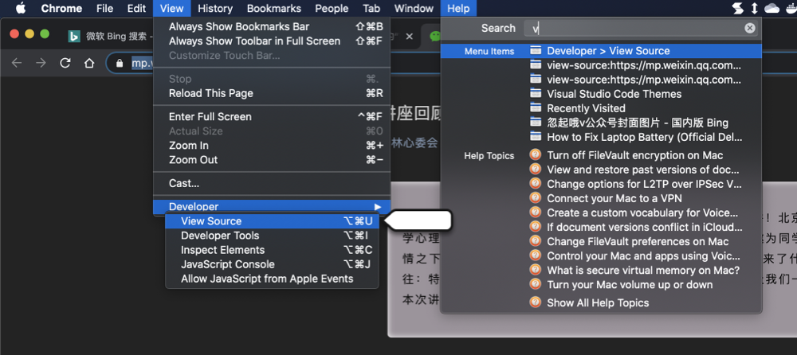
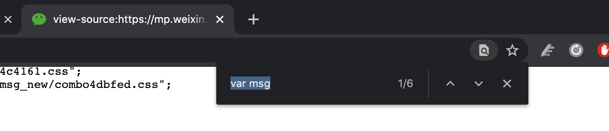
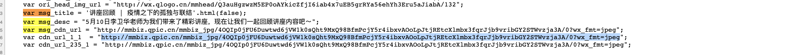
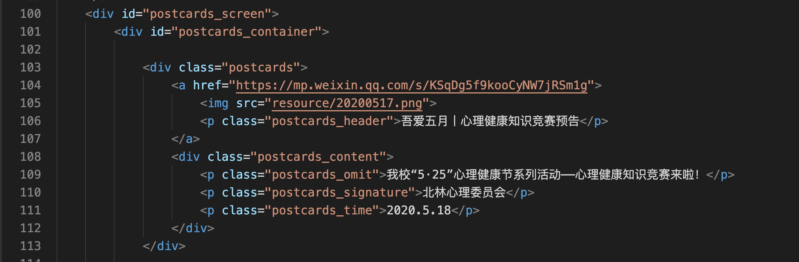

# web 维护流程

## 获取封面图内容

以这一篇推送为例子：

[推送链接](https://mp.weixin.qq.com/s/-CqbFi2P1hS8-H0hwRRkMg)

打开推送之后，首先获取源代码

按 `command+f` 或者 Windows 中可能是 `ctrl+f` 搜索 `var msg`

这其中的链接随便选一个复制到浏览器中打开就是这个推送的封面图，右键保存到本地即可。

保存之后统一改名成推送的日期，这篇推送的日期是 2020-5-13 就改成 `20200513.jpeg` ，扩展名保持不动。

## 修改文本内容

从服务器下载 `index.html` 文本，使用 vscode 打开。

找到第 100 行开始修改，依次替换` <a>  
 `中的内容，其中题目和解释文本的内容要注意长度，如果太长了导致题目换行或者文本溢出，需要自行缩减。

图片的尺寸要注意比例规范，剪裁成适当的长方形即可。完成之后用浏览器检查。

其中标签 `` 中的 `resource/` 部分保持不变，后边的图片名城替换成刚才下载的图片名即可，注意扩展名和刚才下载的图片应当一致。即 ``

一共有三个卡片，后面两个卡片依此类推。

## 上传内容

将刚才下载并改好名字的图片，上传的服务器的  `D:\\xinli2019_1\resource` 中。

将服务器原来的文本 `D:\\xinli2019_1\index.html` 改名为 `index+today.html` 如 `index20200518.html` 并移动到 `D:\\xinli2019_1\html_histry` 文件夹中保留历史备份。

将刚才更改的 `index.html` 上传到 `D:\\xinli2019_1` 中。

在本地的浏览器中检查更改后的网站效果，确认无误，更新工作完成。

## 附录

### 服务器信息

您好，你申请的虚拟机已经开通。基本信息如下：
IP：202.204.121.152
用户名及密码：Administrator / admin123456#
已开放端口：3389、80
请及时修改密码并妥善保管。

### 网站源代码备份

[github.com](https://github.com/quaeast/xinli2019_1)

